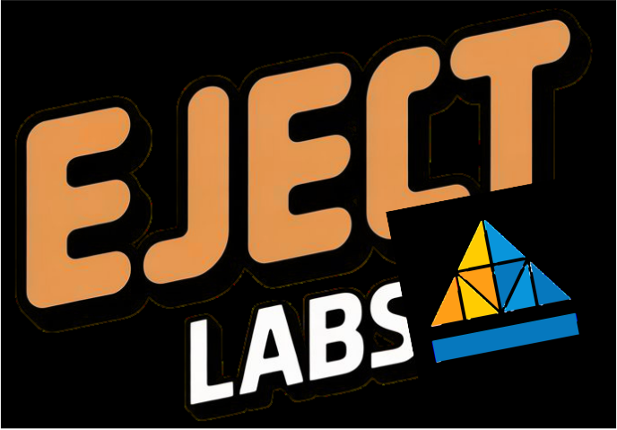

  
  
   

  

    <b>Gerenciamento visual de capacidade e alocação para times ágeis.</b>
  

  

    
  

  

    
    
  

## 🎯 Sobre o Projeto

O **Equilibra** é uma solução desenvolvida para resolver o desafio de equilibrar a carga de trabalho em equipes de tecnologia. Através de uma interface limpa e indicadores visuais, líderes e gestores conseguem identificar gargalos, evitar burnout e garantir que os projetos tenham os recursos necessários.

---

## ✨ Funcionalidades Principais

### 1. 📊 Dashboard de Capacidade Inteligente
O coração do sistema. Oferece uma visão imediata da saúde do time:
* **Cálculo Automático de Carga:** O sistema soma pontos de projetos e atividades extras automaticamente.
* **Indicadores Visuais de Risco:**
    * 🟢 **Verde:** Carga saudável ou disponibilidade.
    * 🔴 **Vermelho:** Sobrecarga crítica (alerta visual imediato).
* **Barras de Progresso:** Visualize a porcentagem de ocupação de cada membro em relação ao limite ideal.

### 2. 🚀 Gestão de Projetos e Alocação
Controle total sobre onde o esforço do time está sendo investido:
* **Distribuição de Pontos:** Defina a complexidade/peso de cada projeto.
* **Alocação Múltiplos:** Um membro pode estar em vários projetos simultaneamente; o sistema cuida da matemática.
* **Scrum Master Dedicado:** Possibilidade de definir um Scrum Master para o projeto, contabilizando essa responsabilidade na carga de trabalho dele.

### 3. 🧩 Atividades Extras
Reconhece que o trabalho não é apenas codar. O sistema permite adicionar cargas que geralmente ficam "invisíveis":
* Participações em GT's;
* Participação em atividades alternativas;

### 4. 🔄 Sincronização em Tempo Real
* **Integração com Supabase:** Todos os dados são persistidos na nuvem de forma segura.
* **Atualização Manual Inteligente:** Botão de *refresh* com feedback visual para garantir que você esteja vendo os dados mais recentes sem precisar recarregar a página inteira.

### 5. 👥 Gestão de Membros
* **CRUD Completo:** Adicione novos contratados, edite cargos ou remova membros (com modal de confirmação de segurança).
* **Perfis:** Visualize cargo, nivel de sobrecarga e projetos alocados.

---

## 🛠️ Stack Tecnológica

* **Frontend:** HTML5, CSS3 Avançado, JavaScript ES6+.
* **Backend:** Supabase (Database PostgreSQL + Authentication).
* **Hospedagem:** Vercel.

---

  

  Produto do EJECT LABS 

